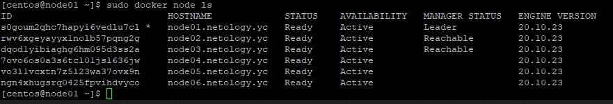
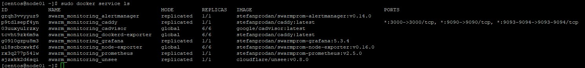

# Домашнее задание к занятию "5. Оркестрация кластером Docker контейнеров на примере Docker Swarm"

## Задача 1

Дайте письменые ответы на следующие вопросы:

- В чём отличие режимов работы сервисов в Docker Swarm кластере: replication и global?
- Какой алгоритм выбора лидера используется в Docker Swarm кластере?
- Что такое Overlay Network?

Ответы:

1. Replication - указанное количество реплицируемых контейнеров распределяются между узлами на основе стратегии планированния. Global - один контейнер запускается на каждом доступном узле в кластере.
2. Использивется алгоримт консенсуса Raft. Исходя из расчетов нагрузки нод, выбирается лидер.
3. Это логическая сеть работающая поверх другой сети. Как пример VPN или PPP.

## Задача 2

  

## Задача 3

  

